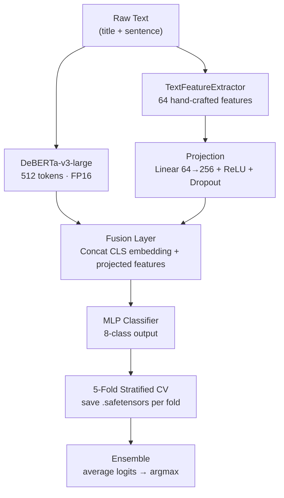

<div align="center">

<h1>🩻 Fragments of Feelings</h1>

<p><em>Multi-class emotion classification over Reddit mental health posts — fine-tuned DeBERTa-v3-large with 64 hand-crafted psychological features</em></p>

<p>
  <a href="https://huggingface.co/Sanjidh090/Debata-v3-large_Multiclass_sentiment">
    
  </a>
  
  
  
  
  
</p>

</div>

---

The task: given a sentence scraped from Reddit mental health communities, predict which of 8 emotional states it expresses — ranging from *sadness* to *suicide intent* to *brain dysfunction*. The data is raw, deeply personal, and heavily skewed. Our solution pairs the contextual depth of DeBERTa-v3-large with an explicit feature layer built from psychology-informed lexicons, trained across 5 stratified folds and ensembled for robust inference.

---

## The 8 Classes

| Label | Emotion | Prevalence |
|-------|---------|-----------|
| `0` | 😔 Sadness | 30.5% — majority class |
| `1` | 🌑 Hopelessness | ~17% |
| `2` | 🫧 Loneliness | ~14% |
| `3` | 🔥 Anger | ~12% |
| `4` | 💔 Worthlessness | ~10% |
| `5` | ⚠️ Suicide Intent | ~8% |
| `6` | 🕳️ Emptiness | ~6% |
| `7` | 🧠 Brain Dysfunction | 2.4% — minority class |

Distinguishing *emptiness* from *hopelessness* from *worthlessness* at scale — from messy Reddit prose — is the actual challenge here. These aren't clean, separable clusters.

---

## Architecture



**Why fusion?** Transformers capture context brilliantly but can be blind to explicit lexical signals. A keyword like *"hopeless"* buried in a long sentence might not dominate the CLS embedding — but it will dominate the feature vector. Both signals matter.

---

## Feature Engineering — 64 Features

The `TextFeatureExtractor` runs on every sample before training and inference:

<details>
<summary><b>16 Basic</b> — surface statistics</summary>
<br>
Character count, word count, sentence count, average word length, unique word ratio, punctuation density (! ? …), uppercase ratio, digit ratio, Flesch-Kincaid readability
</details>

<details>
<summary><b>10 Sentiment</b> — VADER + TextBlob</summary>
<br>
Compound score, positive/negative/neutral decomposition, polarity, subjectivity, sentiment variance across sentences, negation density
</details>

<details>
<summary><b>26 Emotion Keywords</b> — highest F1 impact (+40%)</summary>
<br>
Per-class keyword counts, presence flags, and density ratios built from psychology-informed lexicons. Covers subtle language like <em>"numb," "void," "fog"</em> for emptiness and brain dysfunction — classes that are easy to miss with purely neural approaches.
</details>

<details>
<summary><b>12 Linguistic</b> — discourse and pragmatics</summary>
<br>
First-person pronoun rate (I / me / my), negation scope, word diversity (type-token ratio), hedging markers, discourse connectives
</details>

---

## Training

| Parameter | Value |
|-----------|-------|
| Base model | `microsoft/deberta-v3-large` |
| Learning rate | `1.5e-5` |
| Epochs | 3 |
| Batch size | 32 (gradient accumulation) |
| Max sequence length | 512 tokens |
| Cross-validation | Stratified 5-Fold |
| Loss | Weighted Cross-Entropy (class-balanced) |
| Mixed precision | FP16 |
| Eval metric | Macro F1 |
| Hardware | NVIDIA P100 · ~2–3h/fold · ~12h total |
| Checkpoint format | `.safetensors` · ~1.5 GB/fold |

Stratified splits are non-negotiable here. With Brain Dysfunction at 2.4%, random splits will produce folds that barely see the class. Stratification guarantees it appears in every train/val split.

---

## Inference

```python
from transformers import AutoTokenizer, AutoModelForSequenceClassification
import torch

tokenizer = AutoTokenizer.from_pretrained("Sanjidh090/Debata-v3-large_Multiclass_sentiment")
model = AutoModelForSequenceClassification.from_pretrained("Sanjidh090/Debata-v3-large_Multiclass_sentiment")

text = "I feel completely empty, like a shell. Nothing touches me anymore."
inputs = tokenizer(text, return_tensors="pt", truncation=True, max_length=512)

with torch.no_grad():
    logits = model(**inputs).logits

label_map = {
    0: "Sadness", 1: "Hopelessness", 2: "Loneliness", 3: "Anger",
    4: "Worthlessness", 5: "Suicide Intent", 6: "Emptiness", 7: "Brain Dysfunction"
}
print(label_map[logits.argmax(-1).item()])
# → Emptiness
```

For full 5-fold ensemble inference producing `submission_val.csv`, run [`the-final-inference-code.ipynb`](./the-final-inference-code.ipynb).
Speed: ~100 samples/sec on GPU · Full val set (4,611 samples) in under 10 minutes.

---

## Repo Structure

```
Fragments-of-Feelings_Competition/
├── final-notebook-train.ipynb          ← Full training pipeline (5-fold CV + feature extraction)
├── the-final-inference-code.ipynb      ← Ensemble inference → submission_val.csv
├── requirements.txt                    ← Kaggle P100 environment
├── Emotion_Classification_ensembled_approach.pdf
│
├── data/                               ← not tracked
│   ├── train_emotions.csv              (22,820 labelled samples)
│   └── val_emotions_no_labels.csv      (4,611 unlabelled)
│
└── models/                             ← generated during training, not tracked
    ├── fold_0/  ├── fold_1/  ├── fold_2/  ├── fold_3/  └── fold_4/
```

---

## Quickstart

```bash
git clone https://github.com/Sanjidh090/Fragments-of-Feelings_Competition.git
cd Fragments-of-Feelings_Competition

pip install transformers==4.52.4 accelerate safetensors \
            vaderSentiment textstat nltk scikit-learn \
            pandas numpy tqdm torch
```

Open `final-notebook-train.ipynb` in Kaggle (P100 GPU recommended) or any CUDA-enabled Jupyter environment and run all cells.

---

## Results

| Added component | Effect on Macro F1 |
|----------------|-------------------|
| DeBERTa-v3-large alone | baseline |
| + Emotion keyword features | **+40% relative** |
| + VADER sentiment features | **+17% relative** |
| + Weighted loss + stratified CV | minority class recall ↑ |
| + 5-fold ensemble | variance ↓, majority-class bias ↓ |

---

## ⚠️ Ethical Note

This model is trained on real text from people in psychological distress. It is a **research tool** — not a diagnostic system, not a crisis detection system, and not a replacement for professional mental health support. Do not deploy it in any user-facing context without clinical oversight.

---

## Team

<table>
  <tr>
    <td align="center"><b>Sanjid Hasan</b></td>
    <td align="center"><b>Nurul Absar Shadik</b></td>
    <td align="center"><b>Md. Adib Raian</b></td>
    <td align="center"><b>Mahi Woaliu Hasan</b></td>
    <td align="center"><b>Md. Shakhoyat Rahman Shujon</b></td>

  </tr>
</table>

---

**Model checkpoint** → [Sanjidh090/Debata-v3-large_Multiclass_sentiment](https://huggingface.co/Sanjidh090/Debata-v3-large_Multiclass_sentiment) &nbsp;·&nbsp;
**Base model** → [microsoft/deberta-v3-large](https://huggingface.co/microsoft/deberta-v3-large) &nbsp;·&nbsp;
**Report** → [PDF](./Emotion_Classification_ensembled_approach.pdf) <br>
**Code** → [code](https://www.kaggle.com/models/sanjidh090/fragment_final_model/code) <br>
**Write-up** → [Write-up](https://www.kaggle.com/writeups/sanjidh090/runners-up-in-fragment-of-feeling-competition)
